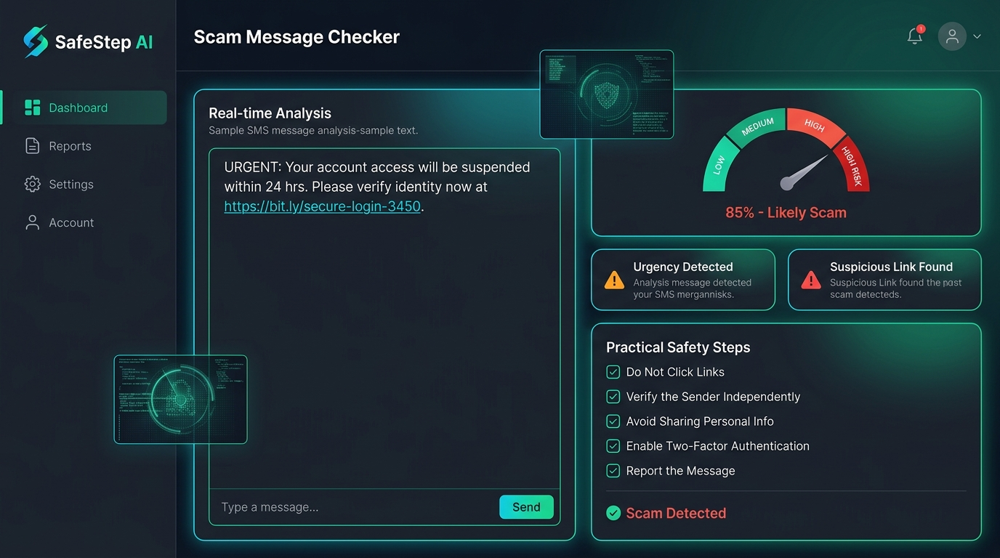

# SafeStep — AI Scam Message Checker 🛡️

[](LICENSE)
[](#)
[-emerald.svg)](#)
[](#)

> **Pause before you trust a message.**  
> A beginner-friendly, educational web application designed to help people spot common scam warning signs in SMS, email, and chat messages before responding.

---

## 📸 Application Preview



---

## 📖 What the Project Does

Every day, millions of people receive deceptive text messages, phishing emails, and urgent chat prompts designed to harvest banking credentials, steal one-time passwords (OTPs), or trick them into non-refundable wire transfers.

**SafeStep** is a lightweight, zero-install educational cybersecurity tool that analyzes pasted message text locally in the browser. It helps users:
1. **Spot 6 Core Scam Red Flags:** Instantly scans for high-pressure deadlines, password/OTP theft, suspicious or shortened URLs, irreversible payment requests, unsolicited lottery prizes, and fake account verification alerts.
2. **Understand the Risk in Plain Language:** Explains *why* each detected sign is dangerous and *why* scammers rely on that psychological tactic.
3. **Defang Dangerous Links:** Automatically converts suspicious URLs into harmless, non-clickable text strings (e.g. `hxxps://evil-bank[.]xyz`) to prevent accidental clicks.
4. **Take Practical Safety Steps:** Provides actionable steps on every result (e.g. never disclose OTPs, do not pay via gift cards, and independently verify with the organization using known official contact channels).
5. **Protect User Privacy:** **100% of the analysis runs locally in browser memory.** Messages are never stored, logged, or transmitted across the internet.

> **Advisory Disclaimer:** SafeStep provides educational guidance based on recognized fraud patterns. It is not a definitive scam detector and cannot legally prove whether a message is authentic or fraudulent. An absence of detected warning signs does not guarantee safety.

---

## 🛠️ Technologies Used

SafeStep was intentionally built without bloated frameworks or paid third-party dependencies, keeping it fast, private, and simple enough for one student to demonstrate:

* **Core Structure:** Semantic HTML5 (`<main>`, `<section>`, `<article>`, `<header>`, `<footer>`, ARIA live regions for accessibility).
* **Styling & UI:** Vanilla CSS3 featuring:
  - Custom cybersecurity design system (deep slate `#070a13`, neon cyan `#00d2ff`, emerald `#10b981`, amber `#f59e0b`, crimson `#ef4444`)
  - Glassmorphism & subtle ambient glows
  - Dynamic Dark / Light theme toggle with `localStorage` persistence
  - Fully responsive mobile & desktop flex/grid layouts
* **Logic & Heuristics:** Modern ES6 JavaScript:
  - Client-side heuristic rule engine with regular expressions & weighted threat scoring
  - Automatic URL extraction and safe string defanging (`http://` ➔ `hxxp://`, `.` ➔ `[.]`)
  - Interactive SVG radial score meter & live character/word counters
* **Typography:** [Google Fonts](https://fonts.google.com/) (`Outfit`, `Inter`, `JetBrains Mono`).
* **Local Server & Testing:** Pure Node.js (zero external npm dependencies required) and Node test runner.

---

## 🚀 How to Run Locally

You can run SafeStep on **Windows, macOS, or Linux** using any of the methods below:

### Prerequisites
* [Node.js](https://nodejs.org/) (v16 or higher) **or** [Python 3](https://www.python.org/)

---

### Option 1: Using the Local Node Server (Recommended)
1. Clone or download this repository:
   ```bash
   git clone https://github.com/YOUR_USERNAME/safestep-scam-checker.git
   cd safestep-scam-checker
   ```
2. Start the local server:
   ```bash
   npm start
   ```
   *(or `node server.js`)*
3. Open your browser to:
   ```
   http://localhost:3000
   ```

---

### Option 2: Using Python Built-in Server
If you prefer Python:
```bash
python -m http.server 3000
```
Then visit `http://localhost:3000` in your web browser.

---

### Option 3: Direct In-Browser Launch
Because SafeStep is built with modern vanilla web technologies, you can simply **double-click `index.html`** or open it directly in Google Chrome, Microsoft Edge, or Mozilla Firefox.

---

## 🌐 Live Demo & GitHub Pages Deployment

To host this project for free on **GitHub Pages**:
1. Go to your repository on GitHub.
2. Click **Settings** ➔ **Pages** (in the left sidebar).
3. Under **Branch**, select `main` and root folder `/ (root)`.
4. Click **Save**. Within 60 seconds, your project will be live at:
   ```
   https://YOUR_USERNAME.github.io/safestep-scam-checker/
   ```

---

## 🧪 Manual Test Scenarios

SafeStep includes one-click sample buttons and an interactive in-app scenario runner:

| Scenario | Input / Action | Expected Result |
| :--- | :--- | :--- |
| **1. Suspicious Phishing Text** | Click **🚨 Suspicious Message Sample** | Flags **3 warning signs** (Urgent demands or threats, Links or shortened URLs, Requests to verify account details), safely defangs the link, and presents practical safety steps. |
| **2. Ordinary Benign Text** | Click **🩺 Ordinary Message Sample** | Displays **“No common warning signs found”**, clarifies that this does not guarantee safety, and provides standard safety hygiene advice. |
| **3. Empty Input** | Leave text box blank and click **Check Message** | Displays friendly guidance: *"Please paste or type an SMS, email, or chat message before checking."* Focuses the textarea with a gentle shake animation; does not crash. |
| **4. Clear Button** | Paste text, check, then click **Clear** | Wipes the text box, resets counters to `0 characters • 0 words`, clears alerts, and resets the results panel to the initial state. |

---

## 🤖 Automated Unit Tests

SafeStep includes an automated test suite verifying edge cases, regex accuracy, URL sanitization, and safety advice guarantees:

```bash
npm test
```
*(or `node test/test-analyzer.js`)*

**Output Preview:**
```text
========================================================
🧪 Running SafeStep Detection Engine Automated Tests
========================================================
Test Group 1: Input Validation & Edge Cases (4/4 Passed)
Test Group 2: Safe URL Defanging (2/2 Passed)
Test Group 3: Suspicious Scam Detection (15/15 Passed)
Test Group 4: Ordinary Messages - Zero False Alarms (12/12 Passed)
Test Group 5: Mandatory Safety Steps Guarantee (3/3 Passed)
Test Group 6: Disclaimer and Transparency (2/2 Passed)

🏁 Test Summary: 38/38 Passed (0 Failed)
✨ All tests passed smoothly!
```

---

## 📂 Project Structure

```
safestep-scam-checker/
├── index.html              # Main accessible web app interface
├── server.js               # Zero-dependency local Node.js HTTP server
├── package.json            # Project manifest (npm start, npm test)
├── .gitignore              # Ignores temp files, logs, and OS caches
├── assets/
│   └── screenshot.jpg      # High-resolution application preview screenshot
├── css/
│   └── style.css           # Vanilla CSS design system, dark/light themes, glassmorphism
├── js/
│   ├── rules.js            # Scam pattern dictionaries, regex matchers, and category weights
│   ├── analyzer.js         # Core detection engine, URL defanger, and safety steps generator
│   ├── samples.js          # Realistic fictional suspicious and ordinary test messages
│   ├── ai-analyzer.js      # Optional AI transparency module with payload preview
│   └── app.js              # UI controller, button bindings, live counters, and test runner
├── test/
│   └── test-analyzer.js    # Automated unit test suite (38 test cases)
└── README.md               # Complete project documentation
```

---

## 🔒 Privacy & Digital Safety Guarantee

* **Zero Data Transmission:** Pasted messages are analyzed in-memory and are never sent over the network or saved to disk.
* **No Information Requests:** The application will never ask you for personal names, bank accounts, or real credentials.
* **Never Paste Secrets:** Users are explicitly reminded never to input real passwords or private security codes.

---

## 📜 License

This project is open-source and available under the [MIT License](LICENSE).
